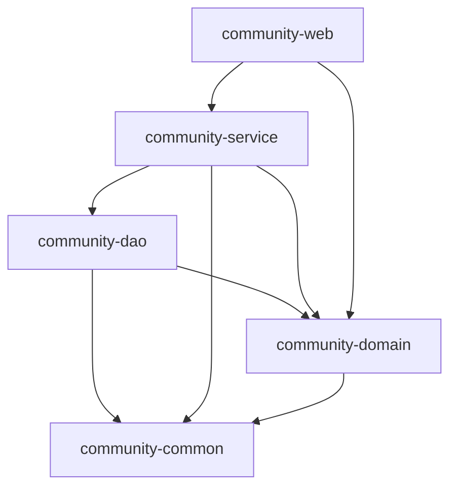

# 社区服务系统 (Community System)

基于Spring Boot 3.4.0的现代化社区服务系统，采用模块化架构设计，便于维护和扩展。

## 技术栈

- **JDK**: 17
- **框架**: Spring Boot 3.4.0, Spring Security, MyBatis Plus 3.5.7
- **数据库**: MySQL 8.0
- **缓存**: Redis
- **安全认证**: JWT 0.11.5
- **API文档**: SpringDoc OpenAPI (Swagger UI)
- **构建工具**: Maven
- **其他**: Lombok, WebFlux, Langchain4j OpenAI

## 项目架构

本项目采用SSM（Spring + Spring MVC + MyBatis）模块化架构：

```
CommunitySystem-Backend/
├── community-common/         # 公共模块
│   ├── 工具类
│   ├── 常量
│   └── 通用配置
├── community-domain/         # 领域模型模块
│   ├── 实体类(Entity)
│   └── 数据传输对象(DTO)
├── community-dao/            # 数据访问层
│   ├── Mapper接口
│   └── XML映射文件
├── community-service/        # 业务逻辑层
│   ├── 服务接口
│   └── 服务实现
└── community-web/            # Web层
    ├── 控制器(Controller)
    ├── 配置类
    └── 启动类
```

## 模块依赖关系



## 环境要求

- JDK 17 或更高版本
- MySQL 8.0 或更高版本
- Redis
- Maven 3.6+ 或更高版本

## 配置说明

### 数据库配置
在 `community-web/src/main/resources/application.yml` 中修改数据库连接信息：

```yaml
spring:
  datasource:
    url: jdbc:mysql://localhost:3306/community_system?useUnicode=true&characterEncoding=UTF-8&serverTimezone=Asia/Shanghai
    username: root
    password: root
```

### Redis配置
```yaml
spring:
  redis:
    host: localhost
    port: 6379
```

## 快速开始

1. 克隆项目到本地
2. 创建MySQL数据库 `community_system`
3. 修改 `application.yml` 中的数据库和Redis配置
4. 在项目根目录执行 Maven 命令：

```bash
mvn clean install
```

5. 运行项目：

```bash
mvn spring-boot:run -pl community-web
```

或者运行 `community-web` 模块中的 `App.java` 启动类。

## API文档

项目集成了SpringDoc OpenAPI，启动项目后可通过以下地址访问API文档：

```
http://localhost:8080/swagger-ui.html
```

## 项目特点

- **模块化设计**: 采用多模块Maven结构，职责清晰，便于维护和扩展
- **安全认证**: 基于JWT的Spring Security安全认证机制
- **统一响应**: 全局统一响应格式设计
- **异常处理**: 全局异常处理机制
- **日志管理**: 集成日志系统，便于问题排查
- **缓存支持**: 集成Redis缓存，提高系统性能
- **API文档**: 自动生成API文档，便于前后端协作

## 开发规范

- 所有接口统一返回格式
- 业务异常使用自定义异常处理
- 数据库操作使用MyBatis Plus
- 服务层添加事务管理
- 控制层统一处理参数校验

## 部署说明

1. 使用Maven打包：
```bash
mvn clean package -pl community-web
```

2. 运行打包后的jar文件：
```bash
java -jar community-web/target/community-web-1.0.0.jar
```

## 贡献指南

1. Fork项目
2. 创建功能分支
3. 提交代码
4. 发起Pull Request

## 许可证

[MIT License](LICENSE)