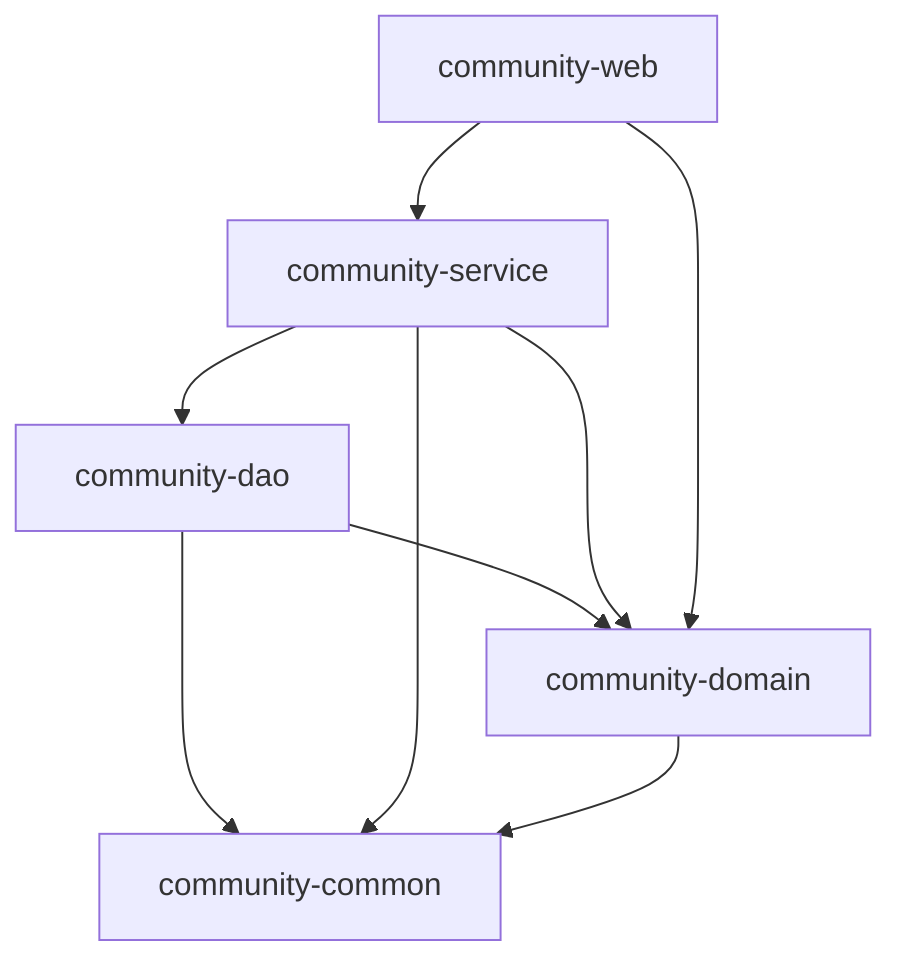

# 社区服务系统 (Community System)

基于Spring Boot 3.3.4的现代化社区服务系统，采用模块化架构设计，便于维护和扩展。该系统为社区管理提供了一套完整的解决方案，包括住户管理、物业缴费、门禁管理、停车位管理、公告通知等功能。

## 技术栈

- **JDK**: 17
- **框架**: Spring Boot 3.3.4, Spring Security, MyBatis Plus 3.5.6, Spring WebFlux
- **数据库**: MySQL 8.0
- **缓存**: Redis
- **安全认证**: JWT 0.11.5
- **API文档**: SpringDoc OpenAPI (Swagger UI) + Knife4j 4.5.0 增强
- **构建工具**: Maven
- **其他**: Lombok, WebFlux

## 项目架构

本项目采用Spring Boot模块化架构，包含以下5个核心模块：

```
CommunitySystem-Backend/
├── community-common/         # 公共模块
│   ├── 配置类 (安全、Web等配置)
│   ├── 工具类 (JWT工具、验证工具等)
│   ├── 异常处理
│   └── 统一响应结果封装
├── community-domain/         # 领域模型模块
│   ├── 实体类(Entity)
│   └── 数据传输对象(DTO)
├── community-dao/            # 数据访问层
│   ├── Mapper接口 (MyBatis Plus)
│   └── 数据访问对象
├── community-service/        # 业务逻辑层
│   ├── 服务接口
│   └── 服务实现
└── community-web/            # Web层
    ├── 控制器(Controller)
    ├── 配置类 (Knife4j、Security等)
    └── 应用启动类
```

## 模块依赖关系



每个模块都有明确的职责和依赖关系：
- `community-common`：提供公共工具类、配置和通用功能，被所有其他模块依赖
- `community-domain`：定义实体类和数据传输对象，作为数据模型层
- `community-dao`：数据访问层，负责与数据库交互
- `community-service`：业务逻辑层，处理具体业务并调用数据访问层
- `community-web`：Web层，提供RESTful API接口并处理HTTP请求

## 环境要求

- JDK 17
- MySQL 8.0
- Redis
- Maven 3.6+

## 配置说明

### 数据库配置
在 `community-web/src/main/resources/application.yml` 中修改数据库连接信息：

```yaml
spring:
  datasource:
    url: jdbc:mysql://localhost:3306/community?useUnicode=true&characterEncoding=UTF-8&serverTimezone=Asia/Shanghai
    username: root
    password: sheep14
    driver-class-name: com.mysql.cj.jdbc.Driver
```

### Redis配置
```yaml
spring:
  redis:
    host: localhost
    port: 6379
    password: sheep14
    database: 0
```

### JWT配置
```yaml
jwt:
  secret: communitySystemSecretKeyForJWTTokenGenerationAndValidation
  expiration: 86400000
```

## 快速开始

1. 克隆项目到本地
2. 创建MySQL数据库 `community`
3. 修改 `application.yml` 中的数据库和Redis配置
4. 在项目根目录执行 Maven 命令：

```bash
mvn clean install
```

5. 运行项目：

```bash
mvn spring-boot:run -pl community-web
```

或者运行 `community-web` 模块中的 [App.java](community-web/src/main/java/com/community/web/App.java) 启动类。

## API文档

项目集成了SpringDoc OpenAPI和Knife4j增强文档，启动项目后可通过以下地址访问API文档：

```
http://localhost:8080/swagger-ui.html
http://localhost:8080/doc.html
```

### API文档特性

1. **自动生成文档**：基于代码注解自动生成API文档
2. **在线测试**：可在文档界面直接测试API接口
3. **分组管理**：按业务模块对API进行分组管理
4. **安全认证**：支持JWT认证，在文档中可直接输入Token进行认证测试
5. **离线文档**：支持导出离线HTML文档
6. **文档增强**：Knife4j提供了更友好的文档界面和功能

### 文档访问路径

- **Swagger UI界面**：`http://localhost:8080/swagger-ui.html`
- **Knife4j增强界面**：`http://localhost:8080/doc.html`
- **OpenAPI JSON**：`http://localhost:8080/v3/api-docs`

### 离线文档导出

可以通过Knife4j界面导出离线HTML文档，方便在没有网络环境时查阅。在Knife4j界面中，点击`文档管理`->`离线文档`，选择需要导出的版本，即可下载HTML格式的离线文档。

## 项目特点

- **模块化设计**: 采用多模块Maven结构，职责清晰，便于维护和扩展
- **安全认证**: 基于JWT的Spring Security安全认证机制
- **统一响应**: 全局统一响应格式设计
- **异常处理**: 全局异常处理机制
- **日志管理**: 集成日志系统，便于问题排查
- **缓存支持**: 集成Redis缓存，提高系统性能
- **API文档**: 基于注解的自动生成API文档，便于前后端协作
- **连接池**: 使用HikariCP高性能数据库连接池
- **代码简化**: 使用Lombok简化实体类代码

## 开发规范

- 所有接口统一返回[Result](community-common/src/main/java/com/community/common/Result.java)格式
- 业务异常使用自定义异常处理
- 数据库操作使用MyBatis Plus
- 服务层添加事务管理
- 控制层统一处理参数校验
- 使用Knife4j和SpringDoc注解编写API文档

## 部署说明

1. 使用Maven打包：
```bash
mvn clean package -pl community-web
```

2. 运行打包后的jar文件：
```bash
java -jar community-web/target/community-web-1.0.0.jar
```

3. 项目启动后，可通过 `http://localhost:8080` 访问API接口
4. API文档地址：`http://localhost:8080/doc.html`

## 贡献指南

1. Fork项目
2. 创建功能分支
3. 提交代码
4. 发起Pull Request

## 主要功能模块

- 系统管理员管理
- 社区信息管理
- 楼栋管理
- 住户管理
- 房屋管理
- 车辆管理
- 停车位管理
- 停车记录管理
- 门禁设备管理
- 门禁记录管理
- 部门管理
- 员工管理
- 水表电表管理
- 抄表记录管理
- 社区公告管理
- 业主问题管理
- 问题跟进记录管理
- 智能问答知识库管理

## 许可证

[MIT License](LICENSE)